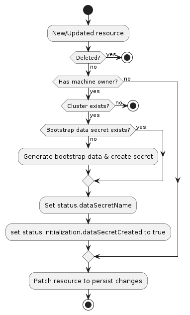

# Bootstrap Provider Specification

## Overview

A bootstrap provider generates bootstrap data that is used to bootstrap a Kubernetes node.

For example, the Kubeadm bootstrap provider uses a [cloud-init](https://cloudinit.readthedocs.io/en/latest/) file for bootstrapping a node.

## Data Types

### Bootstrap API resource
A bootstrap provider must define an API type for bootstrap resources. The type:

1. Must belong to an API group served by the Kubernetes apiserver
2. Must be implemented as a CustomResourceDefinition.
    1. The CRD name must have the format produced by `sigs.k8s.io/cluster-api/util/contract.CalculateCRDName(Group, Kind)`.
3. Must be namespace-scoped
4. Must have the standard Kubernetes "type metadata" and "object metadata"
5. Should have a `spec` field containing fields relevant to the bootstrap provider
6. Must have a `status` field with the following:
    1. Required fields:
        1. `ready` (boolean): indicates the bootstrap data has been generated and is ready
        1. `dataSecretName` (string): the name of the secret that stores the generated bootstrap data
    2. Optional fields:
        1. `failureReason` (string): indicates there is a fatal problem reconciling the bootstrap data;
            meant to be suitable for programmatic interpretation
        2. `failureMessage` (string): indicates there is a fatal problem reconciling the bootstrap data;
            meant to be a more descriptive value than `failureReason`

Note: once any of `failureReason` or `failureMessage` surface on the machine/machine pool who is referencing the bootstrap config object, 
they cannot be restored anymore (it is considered a terminal error; the only way to recover is to delete and recreate the machine/machine pool). 
Also, if the machine is under control of a MachineHealthCheck instance, the machine will be automatically remediated.

Note: because the `dataSecretName` is part of `status`, this value must be deterministically recreatable from the data in the
`Cluster`, `Machine`, and/or bootstrap resource. If the name is randomly generated, it is not always possible to move
the resource and its associated secret from one management cluster to another.

### BootstrapTemplate Resources

For a given Bootstrap resource, you should also add a corresponding BootstrapTemplate resource:

``` go
// PhippyBootstrapConfigTemplateSpec defines the desired state of PhippyBootstrapConfigTemplate.
type PhippyBootstrapConfigTemplateSpec struct {
	Template PhippyBootstrapTemplateResource `json:"template"`
}

// +kubebuilder:object:root=true
// +kubebuilder:resource:path=phippybootstrapconfigtemplates,scope=Namespaced,categories=cluster-api,shortName=pbct
// +kubebuilder:storageversion

// PhippyBootstrapConfigTemplate is the Schema for the Phippy Bootstrap API.
type PhippyBootstrapConfigTemplate struct {
	metav1.TypeMeta   `json:",inline"`
	metav1.ObjectMeta `json:"metadata,omitempty"`

	Spec PhippyBootstrapConfigTemplateSpec `json:"spec,omitempty"`
}

type PhippyBootstrapConfigTemplateResource struct {
	// Standard object's metadata.
	// More info: https://git.k8s.io/community/contributors/devel/sig-architecture/api-conventions.md#metadata
	// +optional
	ObjectMeta clusterv1.ObjectMeta `json:"metadata,omitempty"`

	Spec PhippyBootstrapConfigSpec `json:"spec"`
}
```

The CRD name of the template must also have the format produced by `sigs.k8s.io/cluster-api/util/contract.CalculateCRDName(Group, Kind)`.

### List Resources

For any resource, also add list resources, e.g.

```go
//+kubebuilder:object:root=true

// PhippyBootstrapConfigList contains a list of Phippy Bootstrap Configurations.
type PhippyBootstrapConfigList struct {
	metav1.TypeMeta `json:",inline"`
	metav1.ListMeta `json:"metadata,omitempty"`
	Items           []PhippyBootstrapConfig `json:"items"`
}

//+kubebuilder:object:root=true

// PhippyBootstrapConfigTemplateList contains a list of PhippyBootstrapConfigTemplate.
type PhippyBootstrapConfigTemplateList struct {
	metav1.TypeMeta `json:",inline"`
	metav1.ListMeta `json:"metadata,omitempty"`
	Items           []PhippyBootstrapConfigTemplate `json:"items"`
}
```


### Bootstrap Secret

The `Secret` containing bootstrap data must:

1. Use the API resource's `status.dataSecretName` for its name
1. Have the label `cluster.x-k8s.io/cluster-name` set to the name of the cluster
1. Have a controller owner reference to the API resource
1. Have a single key, `value`, containing the bootstrap data

## Behavior

A bootstrap provider must respond to changes to its bootstrap resources. This process is
typically called reconciliation. The provider must watch for new, updated, and deleted resources and respond
accordingly.

The following diagram shows the typical logic for a bootstrap provider:



1. If the resource does not have a `Machine` owner, exit the reconciliation
    1. The Cluster API `Machine` reconciler populates this based on the value in the `Machine`'s `spec.bootstrap.configRef`
       field.
1. If the resource has `status.failureReason` or `status.failureMessage` set, exit the reconciliation
1. If the `Cluster` to which this resource belongs cannot be found, exit the reconciliation
1. Deterministically generate the name for the bootstrap data secret
1. Try to retrieve the `Secret` with the name from the previous step
    1. If it does not exist, generate bootstrap data and create the `Secret`
1. Set `status.dataSecretName` to the generated name
1. Set `status.ready` to true
1. Patch the resource to persist changes

## Sentinel File

A bootstrap provider's bootstrap data must create `/run/cluster-api/bootstrap-success.complete` (or `C:\run\cluster-api\bootstrap-success.complete` for Windows machines) upon successful bootstrapping of a Kubernetes node. This allows infrastructure providers to detect and act on bootstrap failures.

## Taint Nodes at creation

A bootstrap provider can optionally taint worker nodes at creation with `node.cluster.x-k8s.io/uninitialized:NoSchedule`.
This taint is used to prevent workloads to be scheduled on Nodes before the node is initialized by Cluster API.
As of today the Node initialization consists of syncing labels from Machines to Nodes. Once the labels have been 
initially synced the taint is removed from the Node.

## RBAC

### Provider controller

A bootstrap provider must have RBAC permissions for the types it defines, as well as the bootstrap data `Secret`
resources it manages. If you are using `kubebuilder` to generate new API types, these permissions should be configured
for you automatically. For example, the Kubeadm bootstrap provider the following configuration for its `KubeadmConfig`
type:

```
// +kubebuilder:rbac:groups=bootstrap.cluster.x-k8s.io,resources=kubeadmconfigs;kubeadmconfigs/status,verbs=get;list;watch;create;update;patch;delete
// +kubebuilder:rbac:groups="",resources=secrets,verbs=get;list;watch;create;update;patch;delete
```

A bootstrap provider may also need RBAC permissions for other types, such as `Cluster`. If you need
read-only access, you can limit the permissions to `get`, `list`, and `watch`. The following
configuration can be used for retrieving `Cluster` resources:

```
// +kubebuilder:rbac:groups=cluster.x-k8s.io,resources=clusters;clusters/status,verbs=get;list;watch
```

### Cluster API controllers

The Cluster API controller for `Machine` resources is configured with full read/write RBAC permissions for all resources
in the `bootstrap.cluster.x-k8s.io` API group. This group represents all bootstrap providers for SIG Cluster
Lifecycle-sponsored provider subprojects. If you are writing a provider not sponsored by the SIG, you must add new RBAC
permissions for the Cluster API `manager-role` role, granting it full read/write access to the bootstrap resource in
your API group.

Note, the write permissions allow the `Machine` controller to set owner references and labels on the bootstrap
resources; they are not used for general mutations of these resources.
